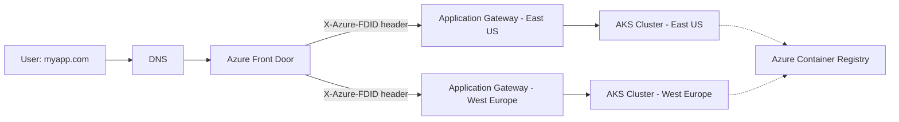

# Azure Multi-Region AKS with Zero Downtime & App Gateway

> **Production-grade, multi-region Kubernetes deployment on Azure, featuring zero-downtime releases, custom DNS, and secure traffic routing with Front Door and Application Gateway.**

---

## 🚀 Overview

This project demonstrates a robust, highly-available architecture for running containerized applications on Azure Kubernetes Service (AKS) across multiple regions. It provides:

- **Global traffic routing** via Azure Front Door
- **End-to-end SSL and WAF protection**
- **Zero-downtime Blue-Green deployments**
- **Custom DNS for your domain**
- **Private and secure regional networking**
- **Automated infrastructure with Terraform**

---

## 🔗 Architecture

The solution consists of the following components:

1. **Azure Front Door (AFD):**  
   Global entry point for all traffic. Handles SSL termination, routing, and WAF.
2. **Custom DNS:**  
   Your domain (e.g., `myapp.com`) points to the Front Door endpoint.
3. **Regional Application Gateways:**  
   One per region, locked down to only accept traffic from Front Door.
4. **AKS Cluster per Region:**  
   Runs your containerized app. Integrated with Application Gateway via AGIC (Ingress Controller).
5. **Container Registry:**  
   Stores your Docker images, used for deployments.
6. **Blue-Green Deployment Strategy:**  
   Backend pools in Front Door allow instant, zero-downtime switch between app versions.

### 📦 Diagram



---

## 🛠️ Usage Instructions

### Prerequisites

- Azure Subscription
- [Terraform](https://www.terraform.io/downloads.html) installed
- [Azure CLI](https://docs.microsoft.com/en-us/cli/azure/install-azure-cli) installed
- Docker (for building app images)

### 1. Clone the Repository

```bash
git clone https://github.com/kavya-gouda-m/azure-aks-multi-region-ha.git
cd azure-aks-multi-region-ha
```

### 2. Configure Variables

Edit the variables in `terraform.tfvars` to fit your Azure subscription, regions, and DNS.

### 3. Deploy Infrastructure

```bash
terraform init
terraform plan
terraform apply
```

This will provision:

- Resource groups
- Front Door
- DNS records
- VNETs, subnets
- Application Gateways
- AKS clusters
- ACR

### 4. Build & Push Application Image

```bash
# Example
docker build -t <your-app>:v1 .
az acr login --name <your_acr_name>
docker tag <your-app>:v1 <your_acr_name>.azurecr.io/<your-app>:v1
docker push <your_acr_name>.azurecr.io/<your-app>:v1
```

### 5. Deploy to AKS

- Apply Kubernetes manifests for your app (`kubectl apply -f k8s/`)
- Set up Blue-Green deployments as per documentation

### 6. Zero-Downtime Deployment

- Deploy new version (Green) in parallel
- Update Front Door backend pool to switch traffic from Blue to Green instantly

---

## 📚 Documentation

- [Terraform Modules](./modules/)
- [Architecture Details](./docs/architecture.md)
- [Deployment Strategies](./docs/deployment.md)
- [Cost Estimation](./docs/cost.md)
- [References](#references)

---

## 🏆 Portfolio Value

This project showcases expertise in:

- Cloud-native architectures
- High-availability & disaster recovery
- Infrastructure as Code (Terraform)
- Secure networking & WAF
- Modern deployment strategies (Blue-Green)

---

## 📎 References

- [Azure Front Door Documentation](https://learn.microsoft.com/en-us/azure/frontdoor/front-door-overview)
- [AKS Documentation](https://learn.microsoft.com/en-us/azure/aks/)
- [Terraform Azure Provider](https://registry.terraform.io/providers/hashicorp/azurerm/latest/docs)
- [Blue-Green Deployment Concepts](https://martinfowler.com/bliki/BlueGreenDeployment.html)

---

Feel free to reach out or open issues for questions and improvements!
