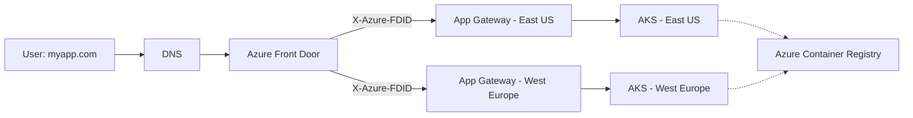

# Project Architecture Overview

This document details the architecture for a production-grade, multi-region AKS deployment on Azure, featuring zero-downtime releases, custom DNS, and secure traffic routing via Azure Front Door and Application Gateway.

---

## 1. High-Level Architecture

### Components

- **Azure Front Door (AFD):**  
  - Global entry point for all HTTP(S) traffic.
  - Provides SSL termination, WAF, caching, and URL-based routing.
  - Handles Blue-Green traffic switching via backend pools.

- **Custom DNS:**  
  - Your domain (e.g., `myapp.com`) configured to point to the Front Door endpoint.

- **Regional Application Gateway (AGW):**  
  - Deployed in each Azure region.
  - Acts as a Layer 7 load balancer, terminating SSL and providing WAF.
  - Locked down to accept traffic only from Front Door (using X-Azure-FDID header custom rule).

- **Azure Kubernetes Service (AKS):**  
  - Cluster per region, running the containerized application.
  - Integrated with AGW through Application Gateway Ingress Controller (AGIC).

- **Azure Container Registry (ACR):**  
  - Stores Docker images for deployments.

- **Blue-Green Deployment:**  
  - Two backend pools (blue/green) in Front Door.
  - Traffic switching is instant and global for zero-downtime releases.

---

## 2. Terraform Modules Structure

```
├── main.tf
├── modules/
│   ├── global/
│   │   ├── frontdoor.tf
│   │   ├── dns.tf
│   │   └── waf.tf
│   └── regional/
│       ├── networking.tf
│       ├── appgateway.tf
│       ├── aks.tf
│       └── acr.tf
```

- **Global Module:**  
  Deploys resources shared across regions: Front Door, DNS, global WAF policy.
- **Regional Module:**  
  Reusable for each region (East US, West Europe, etc.), deploying VNet, subnets, App Gateway, AKS, and ACR.

---

## 3. Traffic Flow Diagram



---

## 4. Blue-Green Deployment Strategy

- Two backend pools in Front Door:
  - **app-blue:** Points to current version endpoints.
  - **app-green:** Points to new version endpoints.

- During deployment:
  1. Deploy new application version ("green") to AKS clusters.
  2. Test "green" version for correctness.
  3. Switch Front Door routing from "app-blue" to "app-green" for instant cutover without downtime.

---

## 5. Security & Networking Highlights

- **Front Door:** Provides global WAF and SSL offloading.
- **App Gateway:** Custom WAF rule ensures only traffic from Front Door (using X-Azure-FDID header) is allowed.
- **AKS:** Private networking via custom VNet and subnet.
- **DNS:** Configures your custom domain for global routing.

---

## 6. Module Responsibilities

| Module        | Purpose                                                         |
|---------------|-----------------------------------------------------------------|
| global/       | Front Door, DNS, global WAF policy                              |
| regional/     | VNet, subnets, App Gateway, AKS, Container Registry             |
| networking.tf | VNet & subnet definitions for AKS and App Gateway               |
| appgateway.tf | App Gateway setup, including WAF and custom rules               |
| aks.tf        | AKS cluster creation, AGIC integration                          |
| acr.tf        | Container Registry for Docker images                            |

---

## 7. References

- [Azure Front Door Overview](https://learn.microsoft.com/en-us/azure/frontdoor/front-door-overview)
- [AKS Documentation](https://learn.microsoft.com/en-us/azure/aks/)
- [Terraform Azure Provider](https://registry.terraform.io/providers/hashicorp/azurerm/latest/docs)
- [Blue-Green Deployment Concepts](https://martinfowler.com/bliki/BlueGreenDeployment.html)

---
